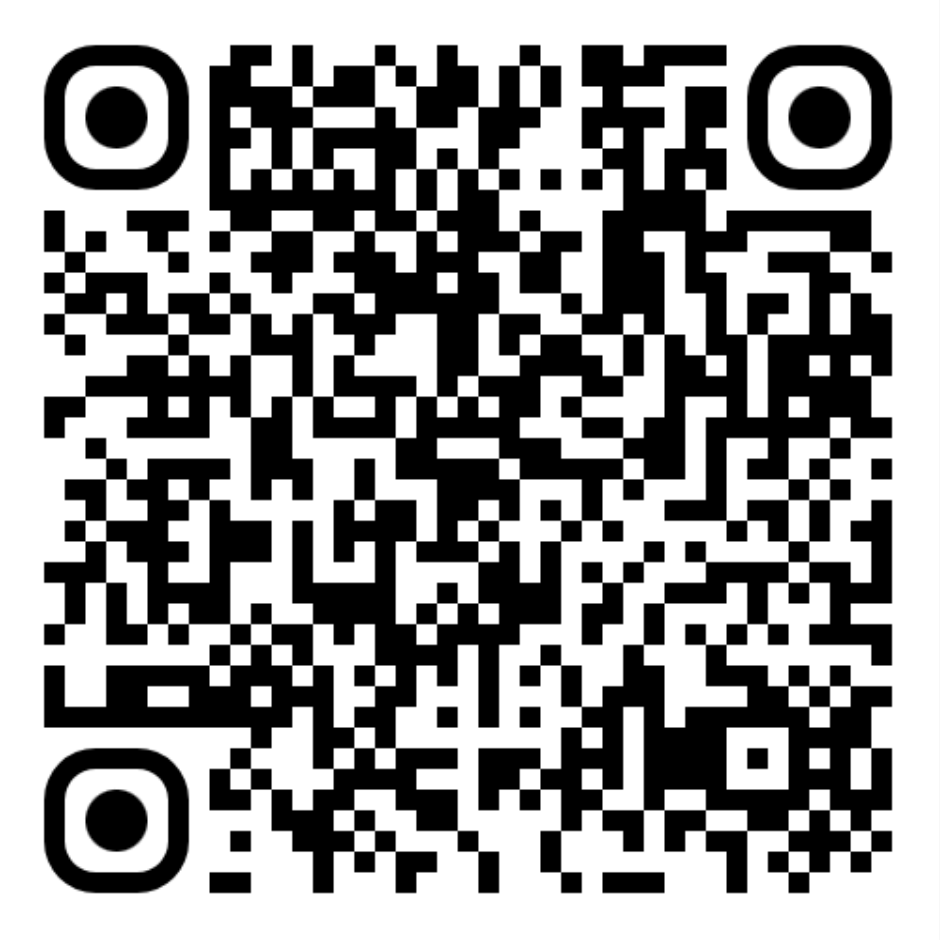
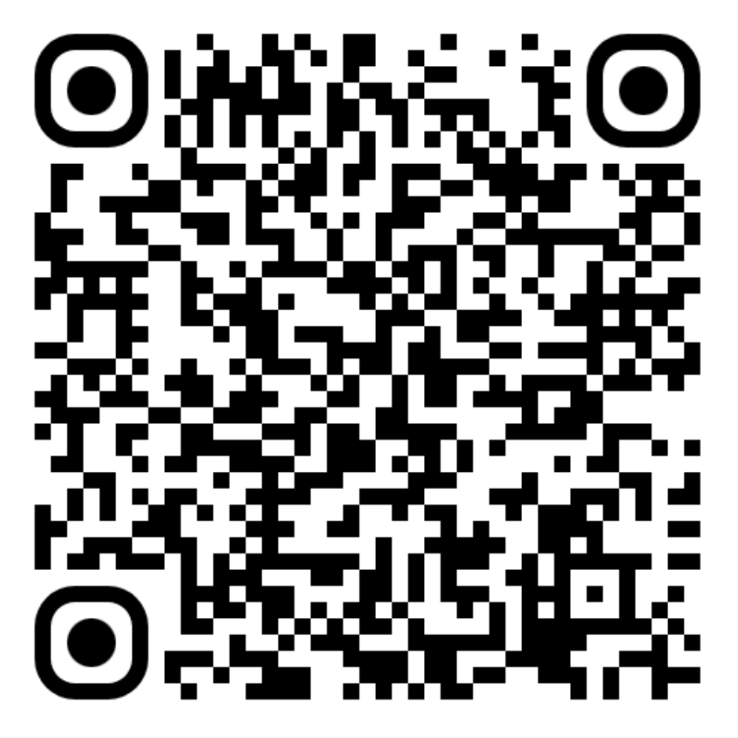

# Candle - Open Source Navigation for the Visually Impaired

Candle is an innovative navigation application designed specifically for visually
impaired or blind individuals. Utilizing state-of-the-art satellite navigation
technology, Candle provides highly accurate GPS routing to help users move safely
and autonomously through their environment. This open-source project welcomes
feedback and contributions through pull requests to enhance its features and
usability.

## Download Candle Now

Scan the QR codes below or click on them to download Candle from your preferred app store.

| Google Play Store                                                                 | Apple App Store                                                                     |
|-----------------------------------------------------------------------------------|-------------------------------------------------------------------------------------|
|  |  |

## Features

### Custom Points of Interest

Easily record and create your own routes or points of interest with just the press
of a button. Candle supports the standard GPX format, allowing for the importation
of routes from other applications or platforms. Share and use routes created by
your family or friends to explore new places together.

### VoicePins

VoicePins is a unique feature that allows users to store voice annotations at
specific locations. These can be played back at any time or automatically during
navigation, providing a personalized and enriching navigation experience.

### Compass Navigation

Featuring an intuitive compass function, Candle helps users orient themselves by
identifying the North or marking specific bearings. This feature, combined with
innovative 3D sound guidance, ensures that users can follow the correct direction
with ease.

### Safety and Peace of Mind

Candle prioritizes user safety by offering real-time tracking services. This allows
friends and relatives to be aware of the user's location at any time. Additionally,
the app includes a feature to send instant alert messages with the user's location,
ensuring help is always within reach if needed.

## Get Involved

As an open-source project, Candle thrives on community support. Whether you're a
developer, a user with feedback, or just someone passionate about improving
navigation for the visually impaired, we welcome your contributions. Help us make
Candle better for everyone by submitting feedback, feature requests, or pull
requests.

## Feedback and Contributions

We are constantly looking to improve Candle and make it the best navigation tool
for the visually impaired. If you have suggestions, feedback, or would like to
contribute to the project, please feel free to open an issue or submit a pull
request on our GitHub repository.

Thank you for supporting Candle, a navigation app that lights the way for visually
impaired and blind individuals to navigate the world more freely and safely.
